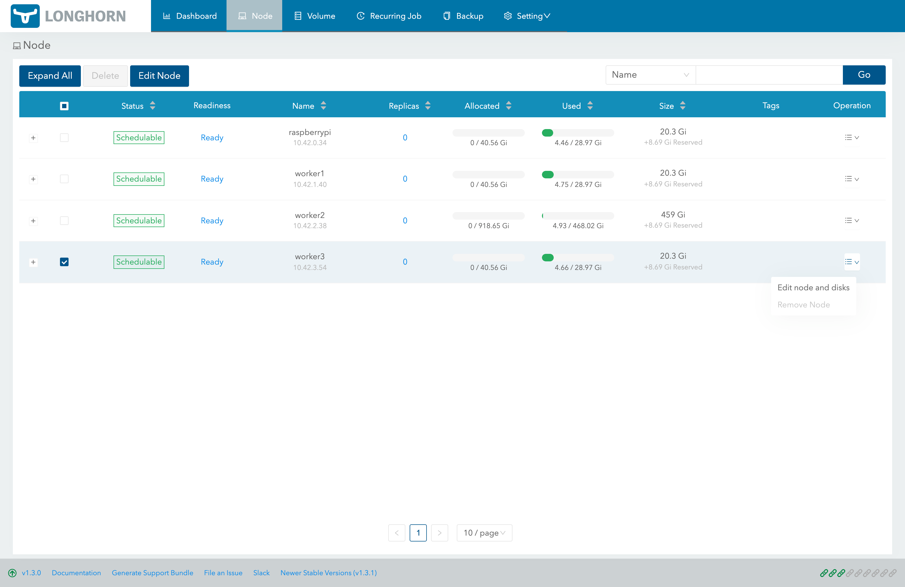
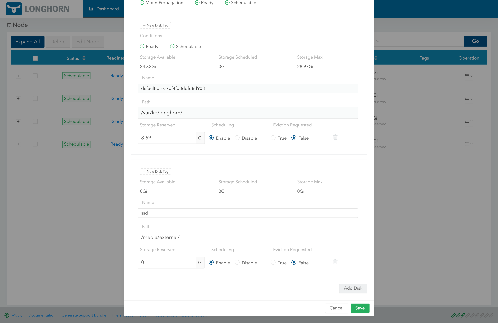
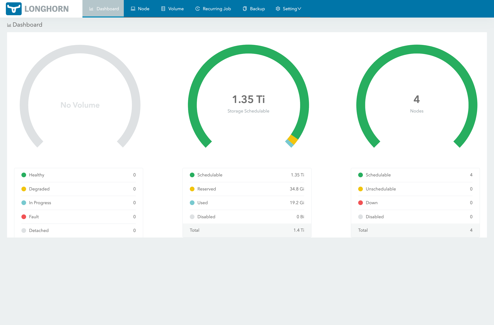

# Install Longhorn to manage volumes

[Longhorn](https://longhorn.io/) is an application to manage highly available persistent storage for Kubernetes.
It can also create easily incremental snapshots and backups.

As your cluster is bare-metal, you need an application to manage the volumes and Longhorn is the easiest solution.

## Add the application with Lizz

Add Longhorn to your cluster with Lizz using the following command:

```
lizz add github \
    --owner=$GITHUB_ORG \
    --fleet=fleet \
    --origin-url=https://github.com/openlizz/application-longhorn \
    --path=./default \
    --destination=longhorn \
    --cluster-role
```

Reconcile the fleet repository with Flux to deploy the application in the cluster:

```
flux reconcile source git flux-system
```

Check that the pods are ready with the following command:

```
kubectl -n longhorn-system get pods
```

After a couple of minutes, the output should be similar to:

```
NAME                                           READY   STATUS    RESTARTS      AGE
longhorn-conversion-webhook-74679ff5cb-g8z8z   1/1     Running   0             33m
longhorn-conversion-webhook-74679ff5cb-fzbwp   1/1     Running   0             33m
longhorn-ui-5c5dfcf6f9-bc7jn                   1/1     Running   0             33m
longhorn-admission-webhook-77795bf954-58lk4    1/1     Running   0             33m
longhorn-admission-webhook-77795bf954-nlj6k    1/1     Running   0             33m
instance-manager-e-ac823c7d                    1/1     Running   0             32m
instance-manager-r-471404dd                    1/1     Running   0             32m
longhorn-manager-kz6dg                         1/1     Running   0             33m
longhorn-manager-lk7fd                         1/1     Running   0             33m
longhorn-manager-5p9cq                         1/1     Running   1 (32m ago)   33m
longhorn-manager-7zg9x                         1/1     Running   1 (32m ago)   33m
instance-manager-r-a3d6577b                    1/1     Running   0             32m
instance-manager-e-5767282f                    1/1     Running   0             32m
instance-manager-r-9a39569b                    1/1     Running   0             32m
instance-manager-e-a77ad366                    1/1     Running   0             32m
longhorn-driver-deployer-6676887758-lvz4v      1/1     Running   0             33m
instance-manager-r-575a9609                    1/1     Running   0             32m
instance-manager-e-b53afa1f                    1/1     Running   0             32m
engine-image-ei-df38d2e5-h86v7                 1/1     Running   0             32m
engine-image-ei-df38d2e5-bckff                 1/1     Running   0             32m
engine-image-ei-df38d2e5-z8xcc                 1/1     Running   0             32m
engine-image-ei-df38d2e5-ggnh9                 1/1     Running   0             32m
csi-resizer-7c5bb5fd65-zjsn8                   1/1     Running   0             32m
csi-resizer-7c5bb5fd65-2g88g                   1/1     Running   0             32m
csi-attacher-dcb85d774-b6w7w                   1/1     Running   0             32m
csi-provisioner-5d8dd96b57-7z78z               1/1     Running   0             32m
longhorn-csi-plugin-9278b                      2/2     Running   0             32m
longhorn-csi-plugin-d7d4n                      2/2     Running   0             32m
csi-snapshotter-5586bc7c79-4zntq               1/1     Running   0             32m
csi-snapshotter-5586bc7c79-pdqlv               1/1     Running   0             32m
csi-snapshotter-5586bc7c79-ktjkl               1/1     Running   0             32m
csi-attacher-dcb85d774-kxkvc                   1/1     Running   0             32m
csi-provisioner-5d8dd96b57-9hkr5               1/1     Running   0             32m
csi-resizer-7c5bb5fd65-q75gd                   1/1     Running   0             32m
longhorn-csi-plugin-p5dcw                      2/2     Running   0             32m
longhorn-csi-plugin-b4kpd                      2/2     Running   0             32m
csi-provisioner-5d8dd96b57-hv5mh               1/1     Running   0             32m
csi-attacher-dcb85d774-4wzqv                   1/1     Running   0             32m
```

## Configure Longhorn to add SSDs

You can access the Longhorn frontend using port-forwarding:

```
kubectl -n longhorn-system port-forward svc/longhorn-frontend 8000:80
```

The Longhorn frontend should be accessible at [http://localhost:8000/](http://localhost:8000/).
You can now configure Longhorn by adding the SSDs to the nodes:







## Change Kubernetes storage class

By default, K3s uses local path as default Kubernetes storage class.
With Longhorn installed, a new default storage class has been created.
You can check it by running:

```
kubectl get storageclass
```

The output should be similar to:

```
NAME                   PROVISIONER             RECLAIMPOLICY   VOLUMEBINDINGMODE      ALLOWVOLUMEEXPANSION   AGE
local-path (default)   rancher.io/local-path   Delete          WaitForFirstConsumer   false                  20h
longhorn (default)     driver.longhorn.io      Delete          Immediate              true                   116m
```

Because it is not possible to have two default storage classes and you want Longhorn being the default one, mark the `local-path` storage class as non-default (update the name of the storage class if this is not `local-path`):

```
kubectl patch storageclass local-path -p '{"metadata": {"annotations":{"storageclass.kubernetes.io/is-default-class":"false"}}}'
```

Now when running:

```
kubectl get storageclass
```

The output should be similar to the following with longhorn being the only default storage class:

```
NAME                 PROVISIONER             RECLAIMPOLICY   VOLUMEBINDINGMODE      ALLOWVOLUMEEXPANSION   AGE
longhorn (default)   driver.longhorn.io      Delete          Immediate              true                   116m
local-path           rancher.io/local-path   Delete          WaitForFirstConsumer   false                  20h
```
