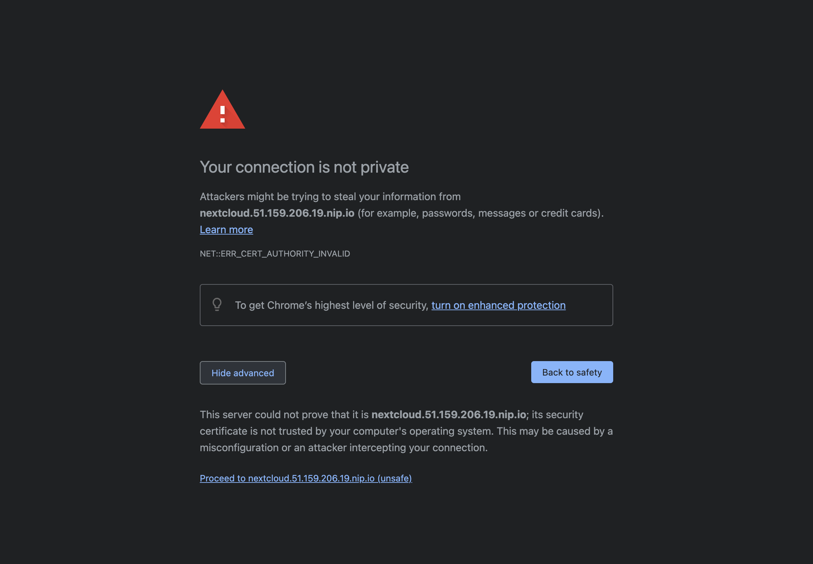
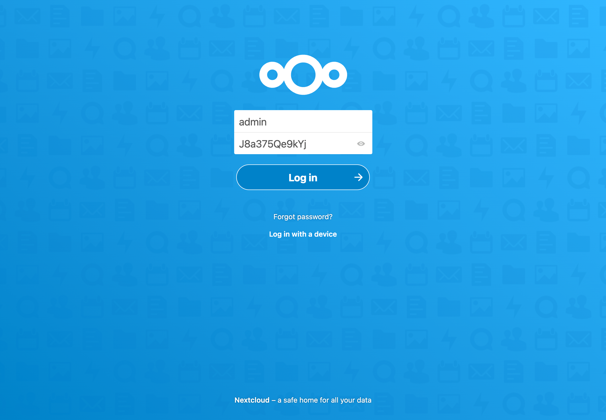

import Tabs from "@theme/Tabs";
import TabItem from "@theme/TabItem";

# Add the applications to your cluster

Now that the Ingress controller is correctly setup and that you have the public IP address of your load balancer, you can continue with the add of the applications.

## Add the domain name application

The [domain name application](https://github.com/Openlizz/application-domain-name) is a very simple application.
Its only purpose is to contain the domain name value that can later be used by other applications.

The domain name value is a [user value](../../concepts/values#user-value) that has to be given to the application using the `--set-value` flag.
You can use [nip.io](https://nip.io/) to map the IP address of your load balancer to a hostname.

:::info

You can also use another value if you have a domain name that you can configure with the load balancer's IP address.

:::

```
lizz add github \
    --owner=$GITHUB_USER \
    --fleet=fleet \
    --origin-url=https://github.com/openlizz/application-domain-name \
    --path=./ \
    --destination=domain-name \
    --set-value value="$LB_IP.nip.io" \
    --personal
```

## Add the cert-manager and cluster-issuer applications

The [cert-manager application](https://github.com/Openlizz/application-cert-manager) installed the [cert-manager helm chart](https://cert-manager.io/docs/installation/helm/) in your cluster.
It is a certificate controller for Kubernetes and will allow you to obtain a TLS certificate to enable HTTPS.

The [cluster-issuer application](https://github.com/Openlizz/application-cluster-issuer) is coupled with the cert-manager application and installed the [cluster issuer](https://cert-manager.io/docs/configuration/) of your choice depending of the `--path` used.
When adding the application, replace `<your email address>` with your email address.

:::info

You can replace `./http01_staging` by `./http01` if you want to use the production ACME server. Note this does not work with [nip.io](https://nip.io/) as there are too many requests with this domain name.

:::

```
lizz add github \
    --owner=$GITHUB_USER  \
    --fleet=fleet \
    --origin-url=https://github.com/openlizz/application-cert-manager \
    --path=./default \
    --destination=cert-manager \
    --cluster-role \
    --personal

lizz add github \
    --owner=$GITHUB_USER  \
    --fleet=fleet \
    --origin-url=https://github.com/openlizz/application-cluster-issuer \
    --path=./http01_staging \
    --destination=cluster-issuer \
    --cluster-role \
    --set-value email=<your email address> \
    --personal
```

## Add the PostgreSQL application

The [PostgreSQL application](https://github.com/Openlizz/application-postgresql) deploys to the cluster a [PostgreSQL database](https://www.postgresql.org/).
The database can later be used by other applications like Nextcloud or Vaultwarden.

```
lizz add github \
    --owner=$GITHUB_USER \
    --fleet=fleet \
    --origin-url=https://github.com/openlizz/application-postgresql \
    --path=./default \
    --destination=postgresql \
    --personal
```

## Add the Photoprism, Nextloud, Vaultwarden, and Homer applications

The [Photoprism application](https://github.com/Openlizz/application-photoprism/) deploys [Photoprism](https://photoprism.app/), the [Nextloud application](https://github.com/Openlizz/application-nextcloud) deploys [Nextloud](https://nextcloud.com/), the [Vaultwarden application](https://github.com/Openlizz/application-vaultwarden) deploys [Vaultwarden](https://github.com/dani-garcia/vaultwarden) and the [Homer application](https://github.com/Openlizz/application-homer) deploys [Homer](https://github.com/bastienwirtz/homer).

Those four applications do not require a particular setup and can be added using the following commands:

```
lizz add github \
    --owner=$GITHUB_USER  \
    --fleet=fleet \
    --origin-url=https://github.com/openlizz/application-photoprism \
    --path=./default \
    --destination=photoprism \
    --personal

lizz add github \
    --owner=$GITHUB_USER  \
    --fleet=fleet \
    --origin-url=https://github.com/openlizz/application-nextcloud \
    --path=./default \
    --destination=nextcloud \
    --personal

lizz add github \
    --owner=$GITHUB_USER  \
    --fleet=fleet \
    --origin-url=https://github.com/openlizz/application-vaultwarden \
    --path=./default \
    --destination=vaultwarden \
    --personal

lizz add github \
    --owner=$GITHUB_USER  \
    --fleet=fleet \
    --origin-url=https://github.com/openlizz/application-homer \
    --path=./default \
    --destination=homer \
    --personal
```

:::info

The outputs of these commands contain passwords that you need to store in order to connect to the applications.

For example for Nextcloud:

```
 → adminPassword — Password for the admin account.
 → J8a375Qe9kYj
```

Note that you can also always find the passwords afterwards in the Kubernetes secrets.

:::

## Reconcile the fleet repository

With the add command, Lizz creates the application repositories and updates the fleet repository but Lizz does not interact with Kubernetes and therefore the applications are not deployed yet.

The deployement is made by Flux and you can force Flux to reconcile and deploy the applications now by running:

```
flux reconcile source git flux-system
```

This will start the deployment process.
You can watch the applications deployment with:

```
flux get kustomizations --all-namespaces
```

The output should be similar to:

```
NAMESPACE   	NAME        	REVISION    	SUSPENDED	READY	MESSAGE
cert-manager	cert-manager	main/7c29c17	False    	True 	Applied revision: main/7c29c17
homer	        homer	        main/b0dac60	False	    True	Applied revision: main/b0dac60
postgresql	    postgresql	    main/b86d39d	False	    True	Applied revision: main/b86d39d
flux-system	    flux-system	    main/0f03192	False	    True	Applied revision: main/0f03192
ingress-nginx	ingress-nginx	main/64ddf5e	False	    True	Applied revision: main/64ddf5e
domain-name	    domain-name	    main/af1ffbe	False	    True	Applied revision: main/af1ffbe
photoprism	    photoprism	    main/b41ee0a	False	    True	Applied revision: main/b41ee0a
vaultwarden	    vaultwarden	    main/12fa546	False	    True	Applied revision: main/12fa546
flux-system	    applications	main/0f03192	False	    True	Applied revision: main/0f03192
cluster-issuer	cluster-issuer	main/9bfb7d0	False	    True	Applied revision: main/9bfb7d0
nextcloud	    nextcloud	    main/a5e5c8d	False	    True	Applied revision: main/a5e5c8d
```

You can check that the pods are running with:

```
kubectl get pod --all-namespaces
```

After a couple of minutes, the output should be similar to:

```
NAMESPACE       NAME                                        READY   STATUS    RESTARTS      AGE
cert-manager    cert-manager-cainjector-9cc6bbc8b-dtqpr     1/1     Running   0             4m9s
cert-manager    cert-manager-ddd4d6ddf-6bxtx                1/1     Running   0             4m9s
cert-manager    cert-manager-webhook-678c96cb8f-rlbwb       1/1     Running   0             4m9s
flux-system     helm-controller-6fd9c49774-wjfdz            1/1     Running   0             9m46s
flux-system     kustomize-controller-5b6576ff96-htpvs       1/1     Running   0             9m46s
flux-system     notification-controller-54f474bd8-tw4s8     1/1     Running   0             9m46s
flux-system     source-controller-9ffdccb9f-tbxk6           1/1     Running   0             9m46s
homer           homer-7f56fc5d4c-n98gr                      1/1     Running   0             2m57s
ingress-nginx   ingress-nginx-controller-686556747b-rqgtf   1/1     Running   0             7m6s
kube-system     cilium-hdscg                                1/1     Running   0             15m
kube-system     cilium-k78qv                                1/1     Running   0             15m
kube-system     cilium-m56kf                                1/1     Running   0             15m
kube-system     cilium-operator-8478f7f488-98k7j            1/1     Running   0             18m
kube-system     coredns-855bb8ff55-x8rlk                    1/1     Running   0             18m
kube-system     csi-node-4dw9s                              2/2     Running   0             15m
kube-system     csi-node-5288l                              2/2     Running   0             15m
kube-system     csi-node-fjxz7                              2/2     Running   0             15m
kube-system     konnectivity-agent-56ghd                    1/1     Running   0             15m
kube-system     konnectivity-agent-7gbbg                    1/1     Running   0             15m
kube-system     konnectivity-agent-lbqfm                    1/1     Running   0             15m
kube-system     kube-proxy-kwcpw                            1/1     Running   0             15m
kube-system     kube-proxy-mskq5                            1/1     Running   0             15m
kube-system     kube-proxy-pmk8f                            1/1     Running   0             15m
kube-system     metrics-server-75648cd9bc-j8tj5             1/1     Running   0             18m
kube-system     node-problem-detector-6wnw6                 1/1     Running   0             15m
kube-system     node-problem-detector-s4klf                 1/1     Running   0             15m
kube-system     node-problem-detector-x9c5x                 1/1     Running   0             15m
nextcloud       nextcloud-7f8d8c4d4-cjbwb                   1/1     Running   1 (26s ago)   2m37s
photoprism      photoprism-86b879b6b7-xtx5d                 1/1     Running   0             2m55s
postgresql      postgresql-0                                1/1     Running   0             2m50s
vaultwarden     vaultwarden-bc4c9965d-5m9jm                 1/1     Running   0             2m49s
```

## Automatic configuration

When added to the cluster, the applications have been configured in function of the cluster state.

For example, Nextcloud has been configured:

- with the domain name from the domain name application,
- with the ingress information from the Nginx, the cert-manager, and the cluster-issuer applications to work with HTTPS,
- with the PostgreSQL database from the PostgreSQL application.

You have applications deployed in your cluster that are already configured and ready to use without effort.

## Use the applications

The Photoprism, Nextloud, Vaultwarden, and Homer applications are exposed to internet via ingresses.
You can get all the ingresses in your cluster by running:

```
kubectl get ingress --all-namespaces
```

The output should be:

```
NAMESPACE     NAME          CLASS    HOSTS                              ADDRESS         PORTS     AGE
homer         homer         <none>   homer.51.159.206.19.nip.io         51.159.206.19   80, 443   3m44s
nextcloud     nextcloud     <none>   nextcloud.51.159.206.19.nip.io     51.159.206.19   80, 443   3m24s
photoprism    photoprism    <none>   photoprism.51.159.206.19.nip.io    51.159.206.19   80, 443   3m42s
vaultwarden   vaultwarden   <none>   vaultwarden.51.159.206.19.nip.io   51.159.206.19   80, 443   3m36s
```

You can access and use the applications by accessing their `HOSTS`.

For example, to access Nextcloud: [nextcloud.51.159.206.19.nip.io](https://nextcloud.51.159.206.19.nip.io).
You should see something similar to this where it issued a certificate:



This is expected as you are using the ACME staging server in the cluster-issuer application.
You can not use the ACME production server with [nip.io](https://nip.io) but can if you have you own domain name, see info [here](#add-the-cert-manager-and-cluster-issuer-applications).

After proceed to, you access Nextcloud and can connect using the admin password (from the add command output).



You can also look at the Homer homepage and should see something similar to:


You can refer to the usage section of the applications repositories' readme to see how use the applications.
