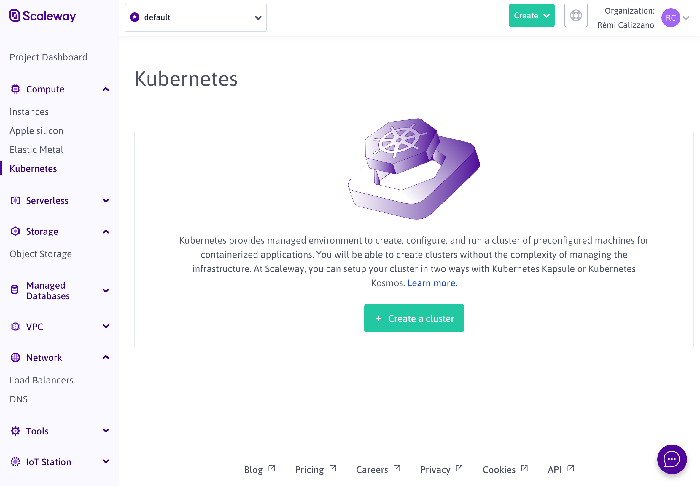
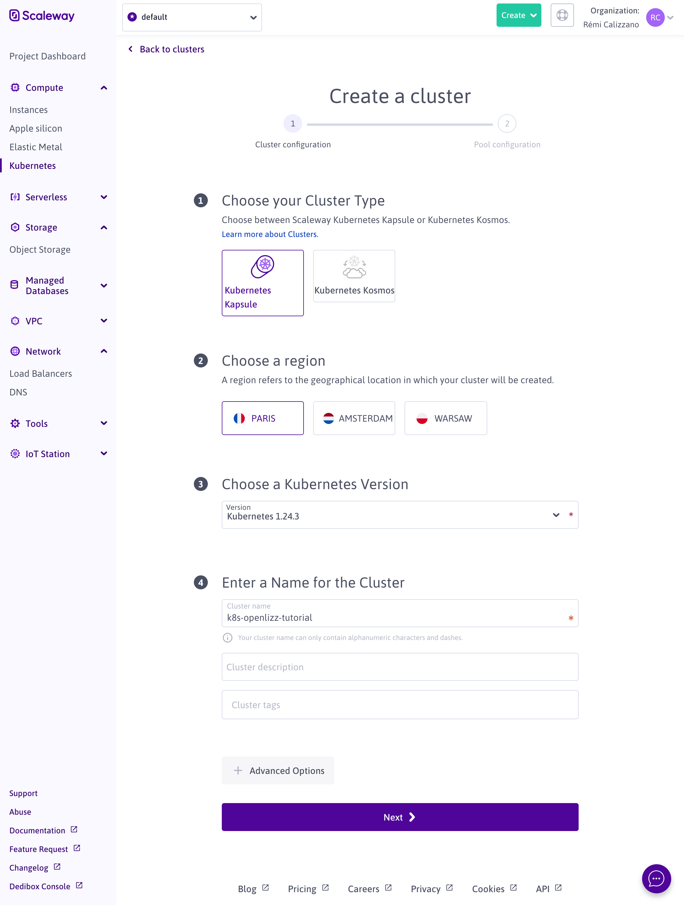
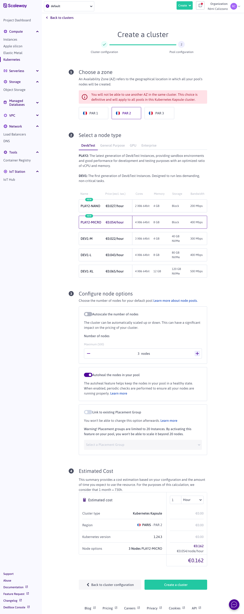
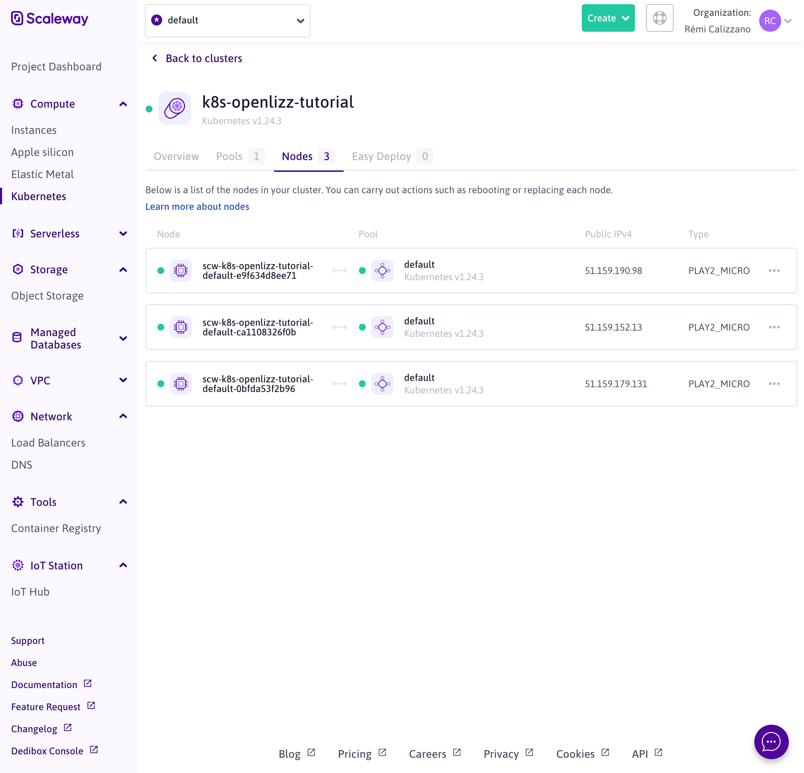
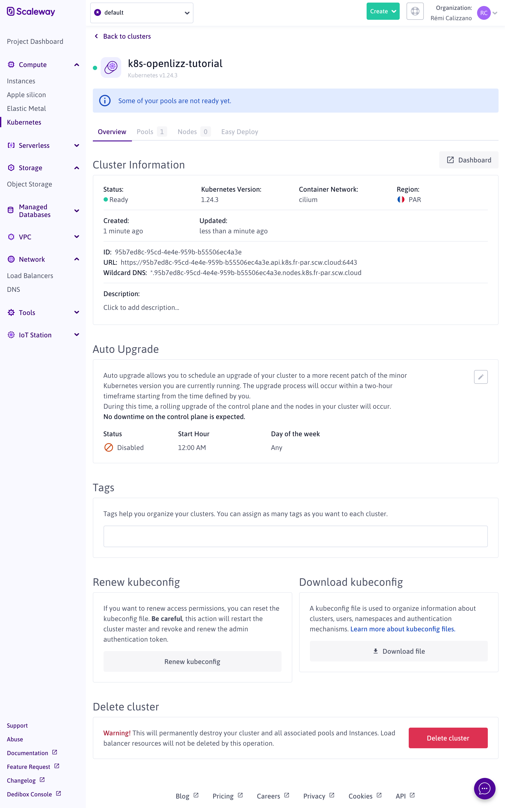

# Create the Kubernetes cluster in Scaleway

Before deploying applications, you first need to create the Kubernetes cluster.
You can use the cloud provider you prefer, in this tutorial we use [Scaleway](https://www.scaleway.com/en/).

:::caution

Following this tutorial includes cost in the cloud provider. Be sure to understand what you do before processing.

:::

## Requirements

You need to create an account and add a payment method in order to be able to create the cluster.
Follow their [registration process](https://console.scaleway.com/register/) to do so.

You also need to have the [kubectl](https://kubernetes.io/docs/tasks/tools/install-kubectl/) CLI installed.

## Configure the cluster

Once you have your account, go to the console, and click on [Kubernetes](https://console.scaleway.com/kapsule/clusters).
You should see the following screen:



Click on "Create the cluster" to start the cluster configuration.

You can use the following configurations, or adapt your cluster depending on your needs:





When the configuration is ready click "Create a cluster" and wait a couple of minutes for the nodes to be ready.



## Connect the cluster locally

In order to be able to interact with the cluster locally, you need to download the kubeconfig file by clicking "Download file":



Now you can check that you can connect the cluster by running:

```
export KUBECONFIG=path/to/kubeconfig-k8s-openlizz-tutorial.yaml

kubectl get nodes
```

The output is similar to:

```
NAME                                             STATUS   ROLES    AGE     VERSION
scw-k8s-openlizz-tutorial-default-5e1ab704fb42   Ready    <none>   2m55s   v1.24.3
scw-k8s-openlizz-tutorial-default-716196f2a51e   Ready    <none>   3m      v1.24.3
scw-k8s-openlizz-tutorial-default-914d4e8fb2ed   Ready    <none>   2m54s   v1.24.3
```
