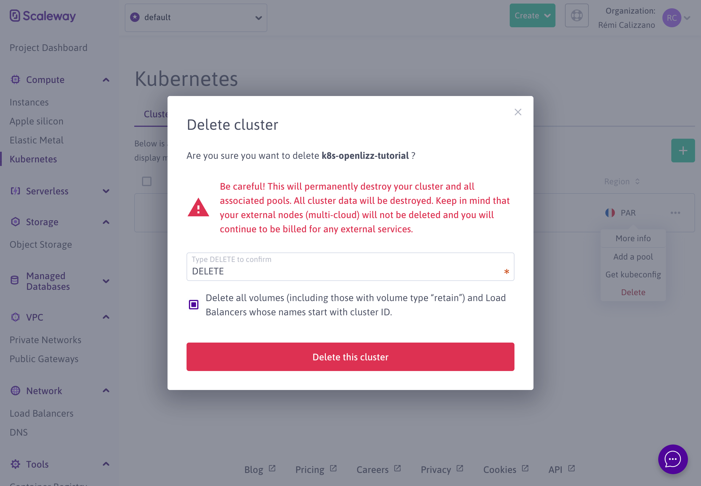

# Conclusion

Congratulation! You have fulfilled this tutorial and successfully deployed applications on a Scaleway Kubernetes cluster using Lizz.

You can now keep the cluster as it is and use the applications, however be aware that this is **not free**. Please refer to the [Scaleway pricing page](https://www.scaleway.com/en/pricing/?tags=containers) to see the cost.

If you don't want to keep the cluster, you can delete it from the [Scaleway console](https://console.scaleway.com/kapsule/clusters). This will **delete all the content of the cluster**.

