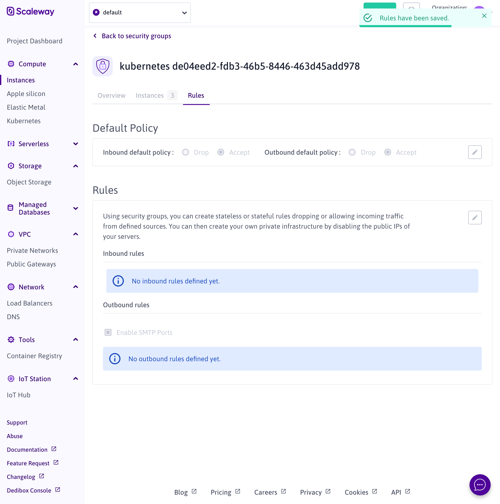
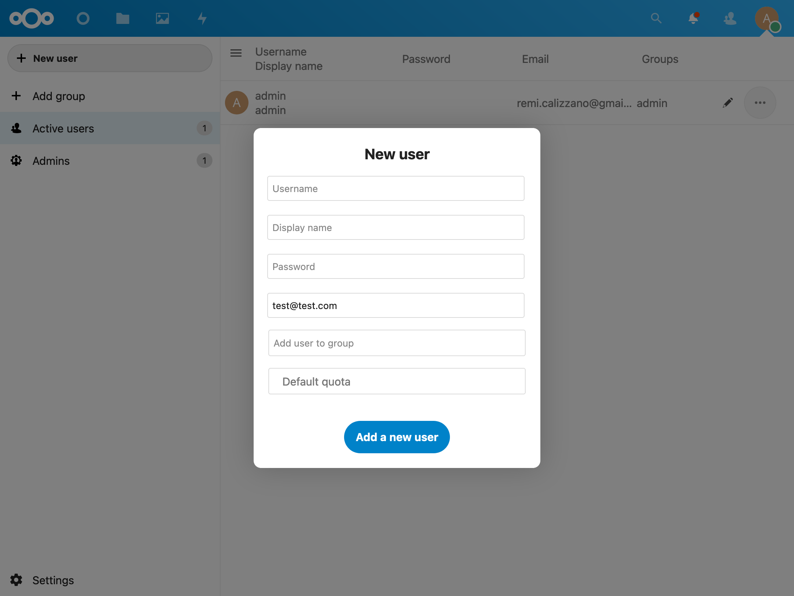

# Setup SMTP server for the applications

Now that you have added applications to your cluster and that they are running correctly, you may have noticed that the Nextcloud and Vaultwarden applications cannot send emails, when create a new user or forget a password for example.

In this tutorial, you will add emails support to these application using [Gmail](https://www.google.com/intl/fr/gmail/about/) and the [SMTP server application](https://github.com/Openlizz/application-smtp-server).

## Create a Google account

If you do no have a Google account already, create one for free from their [signup page](https://accounts.google.com/signup/v2/webcreateaccount?service=mail&continue=https%3A%2F%2Fmail.google.com%2Fmail%2F&flowName=GlifWebSignIn&flowEntry=SignUp).
Gmail allows you to send 500 emails per day which should be enough.

Once you have your Google account, [create an application password](https://support.google.com/accounts/answer/185833) for Gmail.
This avoids issue that could happen if you use 2-Step-Verification.

Now you can export your username and your application password as environement variables to use them later:

```
export SMTP_USERNAME=you@gmail.com
export SMTP_PASSWORD=xxx
```

## Change network rules to enable SMTP ports

By default, Scaleway blocks SMTP ports.
To be able to send emails using SendGrid, you need to change the network rules.
To do so, access the [instances' security groups page](https://console.scaleway.com/instance/security-groups) of the Scaleway console.
From here find the group which corresponds to your cluster, and in the rules tab update the rules as follows:



## Add the SMTP server application

The [SMTP server application](https://github.com/Openlizz/application-smtp-server) is a very simple application that only contains the configuration of the SMTP server.
This configuration is used by other applications to be able to send emails.

```
lizz add github \
    --owner=$GITHUB_USER \
    --fleet=fleet \
    --origin-url=https://github.com/openlizz/application-smtp-server \
    --path=./ \
    --destination=smtp \
    --personal \
    --set-value host=smtp.gmail.com,secure=ssl,port=465,domain=gmail.com,smtpUsername=$SMTP_USERNAME,smtpPassword=$SMTP_PASSWORD
```

## Refresh the Nextcloud and Vaultwarden applications

You can now refresh the Nextcloud and the Vaultwarden applications to refresh their configurations to include the SMTP server configuration.
It is important to set the [Password](../../concepts/values#password) values when refreshing the applications to not create conflicts and avoid malfunction.

```
lizz refresh github \
    --owner=$GITHUB_USER  \
    --fleet=fleet \
    --name=nextcloud \
    --set-value adminPassword="G041xI8NR6tv" \
    --personal

lizz refresh github \
    --owner=$GITHUB_USER  \
    --fleet=fleet \
    --name=vaultwarden \
    --set-value token="b0s23IhOhHRU913o5XmnYqMzg9PkWnaxkR6X79EIK6b5RpYZHPy6jV4CJH4vajkc" \
    --personal
```

## Reconcile the repositories

With the previous lizz commands, the fleet repository changed and needs to be reconciled using the following command:

```
flux reconcile source git flux-system
```

However, you also changed the nextcloud and vaultwarden repositories with the refresh commands, so they need to be reconciled too:

```
flux reconcile -n nextcloud source git nextcloud
flux reconcile -n vaultwarden source git vaultwarden
```

You can wait for the pods to restart:

```
kubectl get pod --all-namespaces --watch
```

You should see the Nextcloud and Vaultwarden pods restarting, wait for the pods to be ready again.

:::info

If the pods are not restarting automaticly, you can delete them to force them to restart.

:::

## Test the applications can send emails

You can test that the applications can send emails by creating a new account in Nextcloud.
To do so, go to the `/settings/users` page of your Nextcloud and click on "New user".



When the new user is created, an email should have been sent to him.

Your applications can well send emails using your Gmail account.

:::info

If the email has not been sent, you can debug the SMTP server configuration from the `/settings/admin` page under the "Email server" section.

:::
